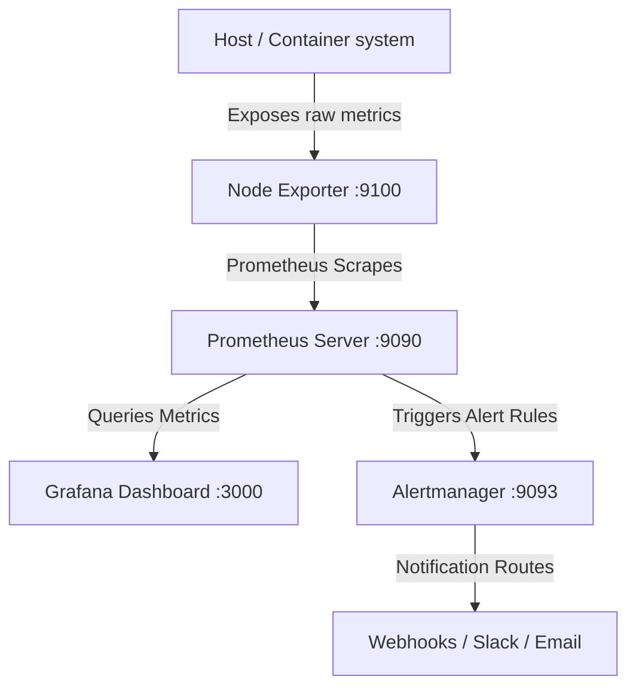

# IT Infrastructure Observability Stack (Prometheus & Grafana)

This repository contains a containerized, self-provisioning infrastructure observability and alerting system. It is designed to run locally using Docker Compose, collecting and visualizing system-level performance metrics and alerting when thresholds are breached.

For an IT Support or Infrastructure Engineer, this project demonstrates key modern skills: **Infrastructure as Code (IaC)**, **observability setup**, **alerts-as-code management**, and **automated dashboard provisioning**.

---

## Architecture



1. **Node Exporter**: An agent that harvests system hardware metrics (CPU, Memory, Disk usage, Network stats) from the host OS.
2. **Prometheus**: A time-series database configured to scrape metrics from Node Exporter every 5 seconds. It evaluates alert rules against incoming data.
3. **Alertmanager**: Receives active alert events from Prometheus, groups them, and coordinates notifications (configured with a webhook placeholder).
4. **Grafana**: A visualization dashboard automatically provisioned to connect to Prometheus and pre-load an infrastructure dashboard.

---

## Port Mappings

Once running, you can access the various services on your local machine:

| Service | Port | Description |
| :--- | :--- | :--- |
| **Grafana** | `http://localhost:3000` | Beautiful visualization dashboard. (Credentials: `admin`/`admin`) |
| **Prometheus** | `http://localhost:9090` | Raw query interface and alert rules viewer. |
| **Alertmanager** | `http://localhost:9093` | Alert aggregation and routing control pane. |
| **Node Exporter** | `http://localhost:9100/metrics` | The raw text metrics gathered from the environment. |

---

## Quick Start Guide

### 1. Prerequisites
Ensure you have **Docker Desktop** installed and running on your machine.

### 2. Launch the Stack
From this directory, open a terminal (PowerShell or command prompt) and run:
```powershell
docker compose up -d
```
Docker will download the lightweight images and spin up the containers in the background.

### 3. Verify Targets
* Open `http://localhost:9090/targets` in your browser.
* Ensure both the `prometheus` and `node-exporter` endpoints show their status as **"UP"**.

### 4. Access the Pre-loaded Dashboard
* Go to `http://localhost:3000` and sign in with username `admin` and password `admin`.
* Skip the password change prompt (or update it).
* Navigate to **Dashboards** (left sidebar) to find the **"Server Infrastructure Performance"** dashboard.
* You should see live, auto-updating metrics for CPU, Memory, Disk space, and Network interfaces.

---

## Alert Rules Defined

Under [prometheus/alert_rules.yml](./prometheus/alert_rules.yml), the following alerting thresholds are configured:

1. **InstanceDown**: Fires if Node Exporter becomes unreachable for > 10 seconds. (Critical)
2. **HighCpuUsage**: Fires if system CPU usage exceeds 70% for > 10 seconds. (Warning)
3. **HighMemoryUsage**: Fires if memory consumption exceeds 80% for > 10 seconds. (Warning)
4. **DiskSpaceWarning**: Fires if disk storage usage exceeds 80% for > 10 seconds. (Warning)

---

## Interactive Demo: Simulating Load & Alerting

To prove the alert system works and demonstrate it to leadership or team members, use the included load simulation script:

1. Open PowerShell and navigate to this folder.
2. Run the simulator script:
   ```powershell
   ./simulate_load.ps1
   ```
3. Select **Option 1 (Container-based CPU Stress)**. This will spin up two infinite loops inside Docker.
4. Watch the Grafana dashboard: CPU utilization will spike.
5. Watch the Prometheus alert viewer (`http://localhost:9090/alerts`):
   * Within 5-10 seconds, the `HighCpuUsage` rule will transition to **PENDING**.
   * After 10 more seconds, the state changes to **FIRING** (turns red).
6. Open Alertmanager (`http://localhost:9093`) to see the alert captured, grouped, and routed.
7. Back in the PowerShell script, select **Option 3 (Stop all CPU Stress tasks)** to shut down the stress containers.
8. Watch Grafana and Prometheus return to their green/healthy states.

---

## 🔗 GitHub Repository
This project's code is maintained on GitHub:
* **Repository Link**: [https://github.com/MADHACKER85/infra-monitoring-stack](https://github.com/MADHACKER85/infra-monitoring-stack)

---

## 🌐 Live Demo & Production Deployment
👉 **Live Netlify Mockup Demo**: [https://super-macaron-1797b4.netlify.app](https://super-macaron-1797b4.netlify.app)

> [!NOTE]
> **Netlify Deployment Mode**: Netlify hosts static files and frontend architectures. Because a full containerized metrics stack (Prometheus/Grafana) requires server-side runtimes, the live link above is a **fully interactive dashboard mockup** built with HTML/CSS/JS (including an interactive CPU stress simulator and live-updating Chart.js charts).
> 
> **How to Deploy the Real Containerized Stack in Production**:
> To deploy the actual Docker Compose stack publicly, you should run it on a cloud Virtual Private Server (VPS):
> * **Providers**: AWS EC2, Azure VM, Google Compute Engine, or DigitalOcean Droplet.
> * **Steps**: Clone this Git repository onto the VPS, ensure Docker is installed, and run `docker compose up -d`. Protect ports `3000`, `9090`, and `9093` using cloud firewalls or a secure Nginx reverse proxy.

---

## 🛡️ Copyright & Disclaimer
**Copyright (c) 2026 MADHACKER85. All Rights Reserved.**

This software is provided under the terms of the **MIT License** (see the [LICENSE](./LICENSE) file for details). 

### 🚫 Copyright Infringement & Fair Use Warning
* Unauthorized commercial distribution, rebranding without attribution, or modification in violation of the MIT License terms constitutes copyright infringement.
* Any usage of this software in commercial or enterprise environments must preserve the original copyright notice and license text in all copies or substantial portions of the software.
* All external trademarks, service marks, and image assets (such as Docker, Prometheus, Grafana, and Netlify logo names) are the intellectual property of their respective owners. No endorsement or partnership is implied.
